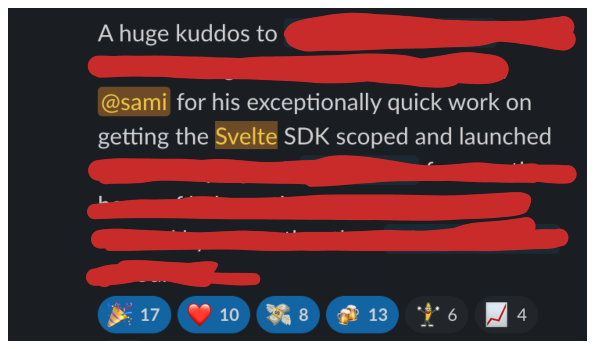
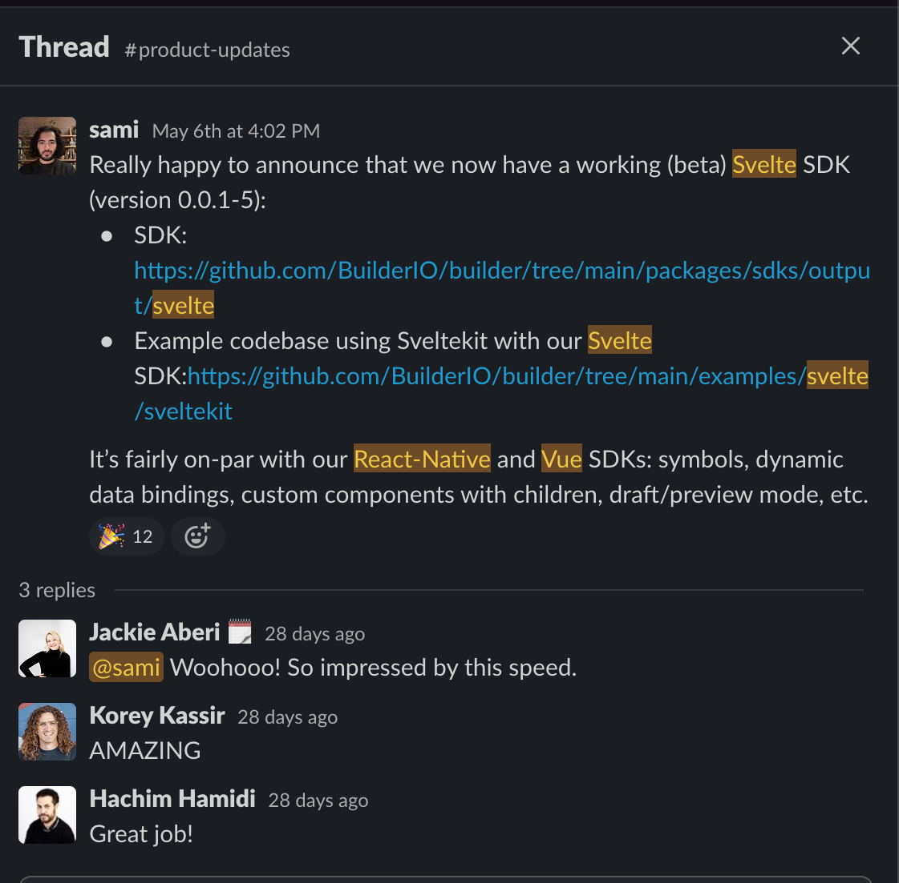

<p align="center"></p>

<p align="center">
  Write components once, compile to every framework
</p>

<p align="center">
  <p align="center">
    Try our  <a href="https://mitosis.builder.io/"><b>interactive fiddle</b></a>
  </p>
</p>

<p align="center">
  <a href="https://github.com/prettier/prettier"></a>
  <a href="https://github.com/BuilderIO/mitosis/pulls"></a>
  <a href="https://github.com/BuilderIO/mitosis"></a>
  <a href="https://www.npmjs.com/package/@builder.io/mitosis"></a>
  <a href="https://www.npmjs.com/package/@builder.io/mitosis" rel="nofollow"></a>
</p>

_PS: We are actively looking for folks interested in becoming contributors to Mitosis. If interested, look at our list of [good first issues](https://github.com/BuilderIO/mitosis/issues?q=is%3Aissue+is%3Aopen+label%3A%22good+first+issue%22) or reach out on our [Discord](https://discord.gg/SNusEyNGsx)_

## Table of contents

- [Quick Start](#quick-start)
- [Manual Setup](#manual-setup)
- [Examples](#examples)
- [What is Mitosis](#what-is-mitosis)
- [In-depth Docs](#docs)
- [Why use Mitosis?](#why-use-mitosis)
  - [Design Systems Maintainers](#design-systems-maintainers)
  - [Teams using multiple web frameworks](#teams-using-multiple-web-frameworks)
  - [Teams building web SDKs](#teams-building-web-sdks)
- [Contribute](#contribute)
- [Community](#community)
- [Related Projects](#related-projects)

## Quick Start

To create a new Mitosis project from scratch, run the following `create` command:

```bash
npm create @builder.io/mitosis@latest
```

It will prompt you for a project name, and create a new directory with a basic monorepo project structure that includes:

- npm workspaces
- multiple generated outputs, along with build steps for each
- multiple test servers that import the outputs for convenient debugging/testing

## Manual Setup

If you would like to install Mitosis manually, you can do so with the following steps below. These generally follow the same steps as the `create` command.

### Note on Monorepo structure

Given that Mitosis generates code for multiple frameworks, it is highly recommend to treat each output as its own npm package for building/publishing purposes. This means that you will most likely need a monorepo solution (such as npm/pnpm/yarn workspaces, or Nx, or Turborepo). While we provide this out-of-the-box in the `create` command, we will leave it up to the user to implement it however they see fit in the Manual setup guide.

### Installation

First, in a new npm project, install the Mitosis CLI and the Mitosis packages:

```bash
npm install @builder.io/mitosis-cli @builder.io/mitosis
```

### Setup `mitosis.config.js`

Then, create a `mitosis.config.js` file in the root of your project, and add the following configuration:

```js
/** @type {import('@builder.io/mitosis').MitosisConfig} */
module.exports = {
  files: 'src/**',
  targets: ['svelte', 'react', 'qwik', 'vue'], //define your desired outputs here
};
```

Check [our configuration docs](/docs/configuration.md#typescript-configuration) for how to setup the Mitosis config file.

### Setup TypeScript

To setup TypeScript, add the following to your `tsconfig.json`:

```jsonc
// tsconfig.json
{
  "compilerOptions": {
    "jsx": "preserve",
    "jsxImportSource": "@builder.io/mitosis"
  }
}
```

### Create a Component

Now, create a `MyComponent.lite.tsx` file in the `src/components` directory:

```tsx
// src/components/MyComponent.lite.tsx
import { useStore } from '@builder.io/mitosis';

type Props = {
  message: string;
};

export default function MyBasicComponent(props: Props) {
  const state = useStore({
    name: 'Foo',
  });

  return (
    <div>
      {props.message || 'Hello'} {state.name}! I can run in React, Vue, Solid, Svelte, Qwik
      andeverything else!
    </div>
  );
}
```

### Build

```bash
npm exec mitosis build
```

🎉 You should now have an `output` directory with your compiled components in all frameworks!

### Recommended: Install ESLint Rules

We recommend you install our [ESLint plugin](./packages/eslint-plugin) to have highly useful rules that guide you as you build your Mitosis components.

### Next up

Our recommended next steps are to:

- add a build step for each generated output (e.g. a Svelte library will need to be build using Sveltekit's [`svelte-package`](https://kit.svelte.dev/docs/packaging) command)
- add a `test-servers/` folder containing web apps that import your outputs, so that you can test them (either manually or programatically).

## Examples

Here are some helpful resources on trying out Mitosis:

- [CKGrafico/papanasi](https://github.com/CKGrafico/papanasi): A framework-agnostic UI library built in Mitosis
- Our [example project](./examples/basic/) is a good starting point for learning how to use Mitosis.
- blog post on creating a Mitosis project: https://blog.logrocket.com/creating-reusable-components-mitosis-builder-io/

## What is Mitosis?

- [this talk](https://portal.gitnation.org/contents/its-time-to-de-fragment-the-web) by Sami Jaber at React Day Berlin is a great intro to Mitosis. It gives a good overview of the impetus behind Mitosis, and a high-level understanding of its different pieces.

- The below video is a brief introduction by Steve Sewell.
  [](https://www.youtube.com/watch?v=XQIuv34-K_8 'Mitosis Video')

## Docs

Curious about how Mitosis code works under the hood, and how to use it? Learn more [in our in-depth docs](docs/).

## Why use Mitosis?

Mitosis is an incredibly powerful and flexible tool. So far, we have identified 3 broad categories of engineering teams that stand to benefit greatly from it:

### Design Systems Maintainers

If you are the maintainer of a design system library that started off in one web framework, then you have felt the tremendous amount of maintenance pain and duplication when creating new versions for subsequent frameworks. Look no further than the popular React library [Chakra UI](https://chakra-ui.com/), and how the maintainers have decided to create [Zag.js](https://zagjs.com/overview/introduction#motivation) after feeling the pain of maintaining state-logic code across both their React and Vue libraries. While Zag.js focuses on writing framework-agnostic interactions, Mitosis focuses on writing framework-specific components. (PS: We are working on building examples that combine these two together. TBD!)

### Teams using multiple web frameworks

If you are part of a team/organization that has multiple frontends built in different frameworks, then you know that coordinating your design system across all of them for a cohesive experience and feel is an absolute nightmare. Mitosis is an excellent tool to eliminate this class of problems, as it allows you to define your designs in your components once and deploy them to all of your separate frontends.

### Teams building web SDKs

If your team is building SDKs for a product that integrates directly into a web framework and involves providing components to the end user, then Mitosis is a _perfect_ fit for your team. Our team at Builder.io has this exact use-case: our [new generation of SDKs](https://github.com/BuilderIO/builder/tree/main/packages/sdks/) is built with Mitosis! Our engineers have received glowing praise from our sales team for speed of delivery, and all it took was a switch flip 😉

<div style="display: flex; flex-direction: column; align-items: center;">
  
  <br/>
  
</div>

## What about XKCD


Yup, we've all seen it. But if this is a concern for you, you may be looking at Mitosis wrong. Rather than just yet-another-component-syntax, Mitosis is a compiler for the frontend, analogous to [LLVM](https://en.wikipedia.org/wiki/LLVM). A toolchain that embraces that there are, and forever will be, many ways of writing components. Mitosis defines a common [intermediate representation](https://en.wikipedia.org/wiki/Intermediate_representation) that allows us to author components once then compile to many frameworks, just like LLVM lets us write code that can compile to any [instruction set architecture](https://en.wikipedia.org/wiki/Instruction_set_architecture). If you look at Mitosis this way, you may more clearly see the value.

Also similarly to LLVM, multiple syntaxes can compile to Mitosis. Our out-of-the-box syntax uses JSX, but we have explored others, such as a Vue/Svelte-like syntax. [Builder.io](https://github.com/builderio/builder) emits Mitosis IR, allowing you to turn designs to code for any supported framework. JSX and Builder.io are the currently supported frontends of the compiler, and the frameworks listed below are the backends.

## E2E test status

| Target  | 01 one component   | 02 two components  |
| ------- | ------------------ | ------------------ |
| alpine  | :white_check_mark: | :white_check_mark: |
| angular | :white_check_mark: | :white_check_mark: |
| qwik    | :white_check_mark: | :white_check_mark: |
| react   | :white_check_mark: | :white_check_mark: |
| solid   | :white_check_mark: | :white_check_mark: |
| svelte  | :white_check_mark: | :white_check_mark: |
| vue2    | :white_check_mark: | :white_check_mark: |
| vue3    | :white_check_mark: | :white_check_mark: |

_NOTE: this matrix is programmatically generated and should not be manually edited._

## Contribute

Interested in contribute? Head over to the [developer](developer/) docs and see how you can get setup & started!

Once you're ready, checkout our [issues](https://github.com/BuilderIO/mitosis/issues?q=is%3Aopen+is%3Aissue+label%3A%22good+first+issue%22) page and grab your first issue!

## Community

- [Mitosis Discord](https://discord.gg/SNusEyNGsx)
- [@Builderio](https://twitter.com/builderio)

## Related Projects

- [Figma plugin](https://github.com/BuilderIO/figma-html): Convert Figma designs into high quality HTML, React, Vue, Svelte, Angular, Solid, etc code via Mitosis.
- [Builder](https://github.com/BuilderIO): Drag and drop page builder and CMS for React, Vue, Angular, and more.
- [Qwik](https://github.com/BuilderIO/qwik): An open-source framework designed for best possible time to interactive, by focusing on resumability of server-side-rendering of HTML, and fine-grained lazy-loading of code.
- [Partytown](https://github.com/BuilderIO/partytown): Relocate resource intensive third-party scripts off of the main thread and into a web worker. 🎉

<br>
<br>
<p align="center">
   <a href="https://www.builder.io/m/developers">
      <picture>
         <source media="(prefers-color-scheme: dark)" srcset="https://user-images.githubusercontent.com/844291/230786554-eb225eeb-2f6b-4286-b8c2-535b1131744a.png">
         
       </picture>
   </a>
</p>
